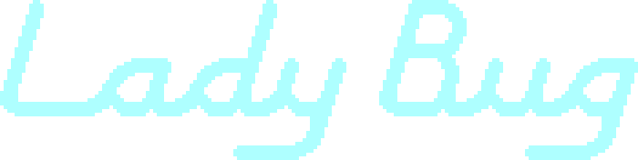
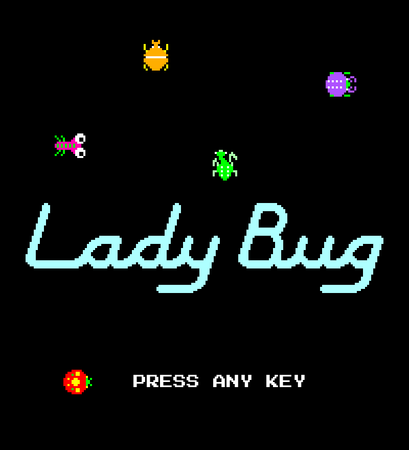
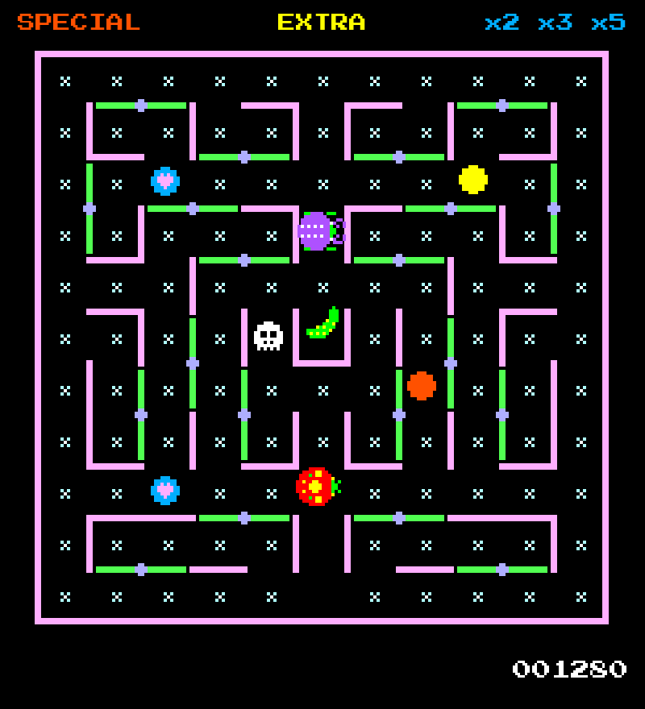
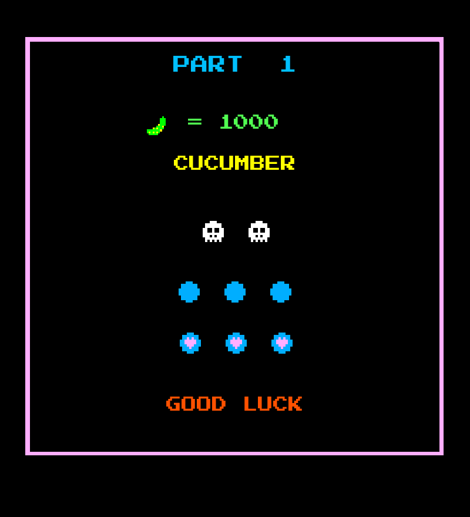

# Lady Bug Web Remake

<p align="center">
  
</p>

A browser-playable remake of the 1981 arcade game **Lady Bug**, built with **Phaser 4**, **TypeScript** and **Vite**.

This repository is the web version of the existing Godot 4 / C# remake:  
<https://github.com/egofree71/LadyBug>

## Play online

The latest deployed version is available through GitHub Pages:

**https://egofree71.github.io/ladybug-web/**

The game is currently intended for **desktop browsers with keyboard or gamepad controls**. There is no dedicated mobile / touch-screen version planned.

## Screenshots

<p align="center">
  
  
</p>

<p align="center">
  
</p>

## About the project

This project is a web-oriented rewrite of the Godot remake of **Lady Bug**. The goal is to keep the game playable in a browser while preserving the arcade feel: grid-based maze movement, rotating gates, collectible timing, enemy release through the border timer, scoring rules, bonus vegetables and the SPECIAL / EXTRA word mechanics.

The web implementation uses the Godot version as the main behavioral reference. Systems are intentionally split into small gameplay, rendering, layout, audio and debug modules so that arcade-specific rules do not get buried inside the Phaser scene.

## Current status

The project is currently a playable prototype.

Implemented systems include:

- Godot-style title screen and game-over flow;
- `PART` transition screens between levels;
- maze rendering and HUD layout based on the Godot coordinate system;
- keyboard and gamepad support;
- player movement with arcade-style assisted turns;
- interactive rotating gates;
- flowers, hearts, letters and skulls;
- score calculation and blue-heart multipliers;
- SPECIAL / EXTRA word progress;
- EXTRA award: +1 life;
- SPECIAL award: +3 lives;
- HUD score, multipliers and up to five visible reserve-life icons;
- player death sequence and life handling;
- respawn from the HUD after losing a life;
- direct level progression after clearing all progress collectibles;
- animated enemy-release border timer;
- level-dependent enemy-release timer speed;
- timer sound for enemy release pressure;
- first playable enemy spawning and movement;
- enemy collision with the player;
- enemy death on skull contact;
- central vegetable bonus;
- temporary enemy freeze after collecting the vegetable, while enemies remain fatal;
- level-dependent enemy sprites and chase timing;
- gameplay sound effects for entry, pickups, gates, timer, enemies, death and level ending;
- browser debug commands for testing gameplay states.

Some systems are still approximate or intentionally not implemented yet:

- exact pixel-perfect enemy edge cases around rotating gates;
- high-score screen and persistence;
- attract-mode / full original arcade presentation flow;
- exact arcade hardware rendering details.

## Controls

### Keyboard

| Action | Input |
| --- | --- |
| Start game | Any accepted keyboard key on the title screen |
| Move | Arrow keys |

The title screen ignores system / utility keys such as `Escape`, `F1`, `F2` and `F12`.

### Gamepad

| Action | Input |
| --- | --- |
| Start game | `A` or `Start` |
| Move | D-pad |
| Move alternative | Left stick, with deadzone |

For movement, the D-pad has priority over the analog stick because Lady Bug needs precise arcade turns.

## Debug mode

Debug commands are available by adding `?debug=1` to the URL, then using the browser console:

```js
ladyBugDebug.help();
ladyBugDebug.status();
ladyBugDebug.releaseNextEnemy();
ladyBugDebug.releaseAllEnemies();
ladyBugDebug.nextLevel();
ladyBugDebug.completeExtraWord();
ladyBugDebug.completeSpecialWord();
ladyBugDebug.runtime();
```

A shorter alias is also available:

```js
lbDebug.status();
```

Debug mode is meant for development and manual testing, especially for systems that are slow to trigger naturally, such as enemy release, vegetable appearance and word-completion awards.

## Technology

- Phaser 4
- TypeScript
- Vite
- GitHub Pages deployment through GitHub Actions

## Development

Install dependencies:

```bash
npm install
```

Start the development server:

```bash
npm run dev
```

Build the production version:

```bash
npm run build
```

Preview the production build locally:

```bash
npm run preview
```

## Useful URL parameters

```text
?native=1
```

Displays the canvas at its real `800 x 880` size. Useful for pixel measurements and alignment checks.

```text
?debug=1
```

Enables the browser-console debug helpers.

Both can be combined:

```text
?native=1&debug=1
```

## Project structure

```text
public/assets/   Runtime assets served by Vite
src/game/audio/  Gameplay sound facade
src/game/debug/  Browser-console debug helpers
src/game/gameplay/ Pure gameplay state and rules
src/game/input/  Keyboard / gamepad input helpers
src/game/layout/ Screen, maze, gate, player and collectible placement constants
src/game/render/ Phaser rendering facades
src/game/scenes/ Main Phaser scene orchestration
doc/             Architecture notes and implementation documentation
```

The detailed architecture document is available here:

```text
doc/static_game_screen_architecture.md
```

## Deployment

The project is deployed to GitHub Pages through the workflow in:

```text
.github/workflows/deploy-pages.yml
```

On push to `main`, the workflow builds the Vite project and publishes the generated `dist` directory.

## Relationship with the Godot remake

The Godot version remains the main reference implementation:

<https://github.com/egofree71/LadyBug>

This web version reuses the same gameplay intent and many of the same assets, but the runtime architecture is adapted to Phaser, TypeScript and browser deployment.

## Disclaimer

This is a personal, non-commercial fan project made for learning, preservation and technical exploration.

**Lady Bug** is the property of its respective rights holders. This project is not affiliated with or endorsed by the original creators, publishers or rights holders.
